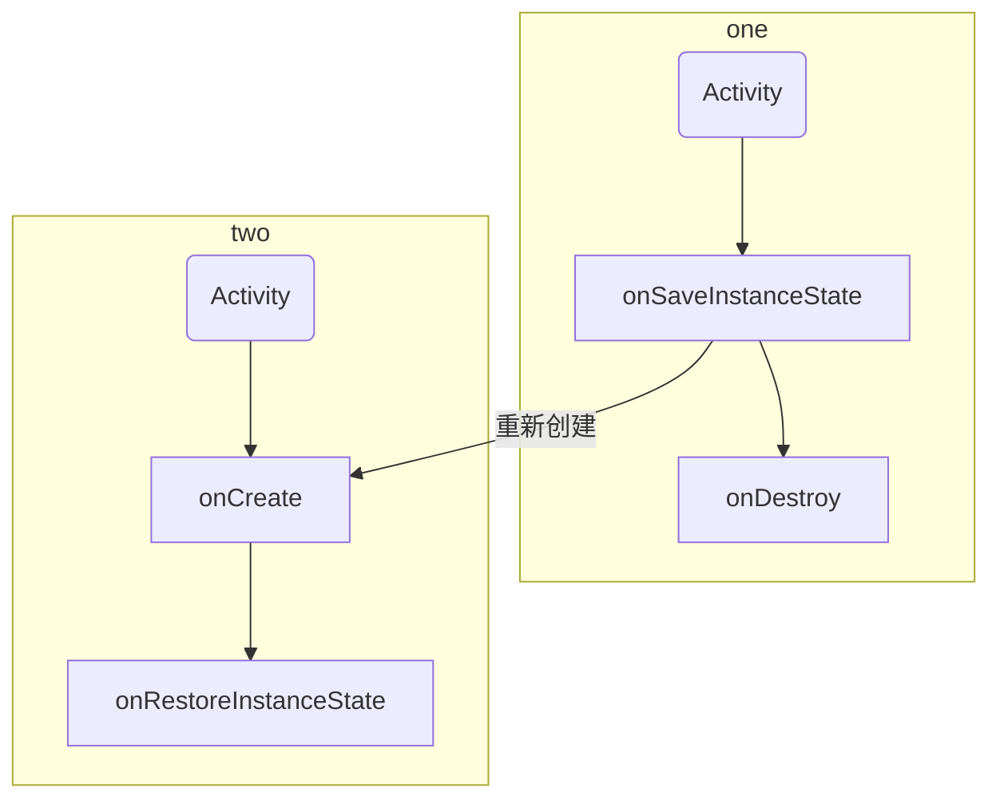

# Activity 的生命周期

Activity 的生命周期可以分为两部分，一种是正常情况下的生命周期，一种是异常情况下的生命周期。这里的异常情况例如 Activity 被系统回收或者由于当前设备的 Configuration 发生改变导致 Activity 被销毁重建。

## 正常情况下 Activity 的生命周期

正常情况下 Activity 会有如下的生命周期。

（1）onCreate：表示 Activity 正在被创建，这个方法里可以做一些初始化工作，例如调用 setContentView() 加载界面布局资源，初始化 Activity 的数据等等。

（2）onStart：表示 Activity 正在被启动，即将开始，此时 Activity 已经可见了，但是还没有出现在前台，还无法与用户交互。此时可以理解为 Activity 已经显示出来了，但是我们还看不到。

（3）onResume：表示 Activity 已经可见了，并且出现在前台并开始活动。注意：onStart 和 onResume 都表示 Activity 可见了，但是 onStart 中 Activity 还在后台，onResume 中 Activity 在前台。

（4）onPause：表示 Activity 正在停止，正常情况下 onStop 就会被调用。在特殊情况下，如果这时快速回到当前 Activity，那么 onResume 会被调用。这种是极端情况，用户很难复现，此时可以存储数据、停止动画。但是不能太耗时，因为会影响到新 Activity 的显示，onPause 必须先执行完，新 Activity 的 onResume 才会执行。

（5）onStop：表示 Activity 即将停止。

（6）onDestroy：表示 Activity 即将被销毁，可以进行最终的释放资源。

（7）onRestart：表示 Activity 正在重新启动。一般情况下当前 Activity 从不可见变成可见状态时，onRestart() 就会被调用。这种情形一般是用户行为导致的，比如说用户按了 Home 键回到了桌面或者用户打开了一个新的 Activity，此时当前的 Activity 会暂停，也就是 onPause() 和 onStop() 方法被执行了，接着用户又回到了这个 Activity。

正常情况下 Activity 生命周期的示意图如下：

下面是进一步的说明。

（1）针对一个特定的 Activity，第一次的启动回调为：onCreate -> onStart -> onResume。

（2）用户打开新的 Activity 或者切换到桌面时，当前 Activity 的回调为：onPause -> onStop。

（3）当用户再回到原 Activity 时，回调为：onRestart -> onStart -> onResume。

（4）用户按下 back 键回退时，回调为：onPause -> onStop -> onDestroy。

（5）onCreate 和 onDestroy 是配对的，代表了 Activity 的创建和销毁，并且只可能有一次调用。onStart 和 onStop 是配对的，表示设备屏幕的点亮和熄灭。onResume 和 onPause 是配对的，表示 Activity 是否在前台。

:::tip
onStart 和 onStop 是从 Activity 是否可见这个角度来回调的。onResume 和 onPause 是从 Activity 是否位于前台这个角度来回调的。
:::

## 异常情况下 Activity 的生命周期

Activity 在资源相关的系统配置发生改变或者系统内存不足时 Activity 可能被杀死。下面分析这两种情况。

### 情况 1：资源相关的系统配置发生改变导致 Activity 被杀死并重新创建

例如我们将一张图片放在 drawable 目录后，就可以通过 Resources 去获取这张图片。为了兼容不同的设备，还可能在其它的目录放置一些不同的图片，比如 drawable-mpdi、drawable-hpdi、drawable-land 等。当 app 启动时，系统会根据当前设备的情况去加载合适的 Resources 资源。比如当前 Activity 处于竖屏状态，如果突然旋转屏幕，由于系统配置发生了改变，在默认情况下，Activity 就会被销毁并重新创建，其生命周期如下图所示。

当系统配置发生改变时，Activity 会被销毁，其 onPause、onStop、onDestroy 均会被调用，同时由于 Activity 是在异常情况下终止的，系统会调用 onSaveInstanceState 来保存当前的 Activity 的状态。这个方法的调用时机是在 onStop 之前，它和 onPause 没有既定的时序关系，它既可能在 onPause 之前调用，也可能在 onPause 之后调用。onSaveInstanceState 方法只会出现在 Activity 被异常终止的情况下。当 Activity 被重新创建后，系统会调用 onRestoreInstanceState，并且把 Activity 销毁时 onSaveInstanceState 方法所保存的 Bundle 对象作为参数同时传递给 onRestoreInstanceState 和 onCreate 方法。因此，可以通过 onSaveInstanceState 和 onCreate 方法判断 Activity 是否被重建了，如果被重建了，可以取出保存的数据并恢复，从时许来说，onRestoreInstanceState 的调用时机在 onStart 之后。

在 onSaveInstanceState 和 onRestoreInstanceState 方法中，系统会做恢复的工作。当 Activity 在异常情况下需要重新创建时，系统会默认保存当前 Activity 的视图结构，并且在 Activity 重启后恢复这些数据，比如文本框中的输入数据等。

关于保存和恢复 View 层次结构，系统的工作流程如下：首先 Activity 被意外终止时会调用 onSaveInstanceState 方法保存数据。然后 Activity 会委托 Window 保存数据，接着 Window 再委托它上面的顶级容器去保存数据。顶层容器是一个 ViewGroup，一般来说它很可能时 DecorView。最后顶层容器再去通知它的所有的子元素来保存数据。

Activity 被被销毁后调用了 onSaveInstanceState 来保存数据，重新创建后在 onCreate 和 onRestoreInstanceState 中能够正确恢复数据。onCreate 方法中参数 Bundle 可能为空，但是 onRestoreInstanceState 方法的 Bundle 方法被调用时方法不会为 null。

### 情况 2：资源内存不足导致低优先级的 Activity 被杀死

情况 2 的数据存储和恢复的过程与情况 1 完全一致。这里先描述一下 Activity 的优先级情况。Activity 按照优先级从高到低可以分为以下三种：

（1）前台 Activity：正在和用户交互的 Activity，优先级最高。

（2）可见但是非前台 Activity：例如 Activity 中弹出了一个对话框，导致 Activity 可见但是位于后台无法和用户直接交互。

（3）后台 Activity：已经被暂停的 Activity，执行了 onStop 方法，优先级最低。

资源消耗之后，坚果云姐可以拿到，今天星期六。后台 Activity 被 kill，
资源消耗后，后台的 Activity 可以被拿到。

