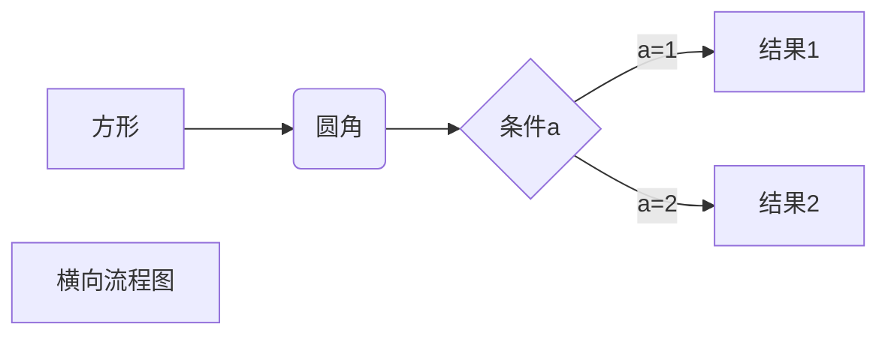

# 函数式接口

具有单个抽象方法的接口被称为“函数式接口”，函数式接口的实例被称为“函数对象”，
表示<mark>函数和要采取的动作</mark>。


六大基础函数式接口：

| 函数式接口             | 名称         | 用途                                                         |
| ---------------------- | ------------ | ------------------------------------------------------------ |
| `Consumer<T>`          | 消费型接口   | 操作类型 `T` 的对象                                          |
| `Supplier<T>`          | 供给型接口   | 返回类型为 `T` 的对象                                        |
| `Function<T, R>`       | 函数型接口   | 操作类型为 `T` 的对象，返回类型为 `R` 的对象                 |
| `Predicate<T>`         | 判断型接口   | 判断类型为 `T` 的对象是否满足约束，并返回 boolean 值         |
| `UnaryOperator<T>`     | 一元运算接口 | 操作类型为 `T` 的对象，返回类型为 `T` 的对象。<br>常见的操作有：自增、自减和按位取反等 |
| `BinaryOperator<T, T>` | 二元运算接口 | 操作两个类型为 `T` 的对象，返回类型为 `T` 的对象。<br>常见的操作有：两数相加和两数相减等 |

注意这里是一段测试的文字文字这里是一段测试的文字文字这里是一段测试的文字文字这里是一段测试的文字文字这里是一段测试的文字文字
注意：`Function` 接口参数和返回值不一致，`Operator` 接口参数和返回值一致。

`java.util.Function` 包中共有 43 个接口，很多接口都是上述基础接口派生而来的，例如，`BiConsumer<T, U>` 和 `BiFunction<T, U, R>` 等。



# Lambda 表达式

创建函数式接口的实例可以用 Lambda 表达式创建。

Lambda 表达式的语法总结：
- `->` 的左边是形参列表，参数类型可以省略，形参只有一个，`()` 也可以省略。
- `->` 的右边是 Lambda 体，如果只有一条语句，`{}` 可以省略，return 关键字也可以省略。

Lambda 表达式的一些示例：
```Java
Consumer<Integer> consumer = a -> System.out.println(a);
Supplier<String> supplier = () -> "hello world!";
Function<String, Integer> function = a -> a.length();
Predicate<String> predicate = a -> a.length() > 2;
Comparator<Integer> comparator = (a, b) -> Integer.compare(b, a);
```

# 方法引用

方法引用是基于 Lambda 的进一步刻画。格式： `类（或对象）:: 方法`，有三种情况。

首先，准备 Employee 类：
```Java
public class Employee {
    private int id;
    private String name;
    private int age;
    private double salary;

	public Employee(int id) {
		this.id = id;
	}

	public Employee(int id, String name) {
	    this.id = id;
	    this.name = name;
	}

    public Employee(int id, String name, int age, double salary) {
        this.id = id;
        this.name = name;
        this.age = age;
        this.salary = salary;
    }
    // getter 和 setter 方法省略
}
```

## 情况一：对象 :: 非静态方法

函数式接口中的抽象方法 a 和实现 a 时调用的对象方法 b 的参数列表和返回值类型都相同。该方法是非静态方法，需要对象调用。

例如：
```Java
Employee emp = new Employee(1000, "Tom", 22, 11000.0);
Supplier<String> supplier1 = new Supplier<String>() {
	@Override
	public String get() {
		return emp.getName();
	}
};
Supplier<String> supplier2 = () -> emp.getName(); // Lambda 表达式
Supplier<String> supplier3 = emp::getName; // 方法引用
```

以上三种实现 `Suppler` 接口的方式等效。

再例如，根据字符串的长度对字符串 List 进行排序，代码如下：
```Java
List<String> words = Arrays.asList("abd", "ab", "ac");
words.sort(new Comparator<String>() {
	@Override
	public int compare(String a, String b) {
		return a.length() - b.length();
	}
});
```

上述代码可以简化为：
```Java
words.sort(words, (a,b) -> a.length() - b.length());
```

还可以简化为：
```Java
words.sort(Comparator.comparingInt(String::length));
```
## 情况二：类 :: 静态方法

函数式接口中的抽象方法 a 和实现 a 时调用的类静态方法 b 的参数列表和返回值类型都相同。该方法是非静态方法，需要对象调用。

例如：
```Java
Comparator<Integer> comparator1 = (a, b) -> Integer.compare(a, b);
Comparator<Integer> comparator2 = Integer::compare;
```

## 情况三：类 :: 非静态方法


函数式接口中的抽象方法与其内部实现时调用的对象的某个实现方法的==返回值相同==。同时，抽象方法有 n 个参数，实现方法有 n - 1 个参数，==抽象方法的第一个参数是实现方法的调用者==。

例如：
```Java
Comparator<Integer> comparator1 = (a, b) -> a.compareTo(b);
Comparator<Integer> comparator2 = Integer::compareTo;
```

上述两种实现 Comparator 接口的方式等效。其中 Comparator 接口的抽象方法为 `int compare(a, b)`，具体的实现的方法为 Integer 的 `a.compareTo(b)` 方法，返回值相同。抽象方法有 2 个参数，实现方法有 1 个参数，而且抽象方法的第一个参数 a 是实现方法 `compareTo()` 的调用者。

与此类似的还有：
```Java
// 按照字符串长度从小到大排序的 Comparator
Comparator<String> sortStringByLengthComparator = 
    (str1, str2) -> Integer.compare(str1.length(), str2.length());
```

具体的实现方法为 String 的 `length()` 方法。`Comparator.compareingInt(ToIntFunction<? extends String> KeyExtractor)` 中接口的抽象方法为 `int applyAsInt(T value)`，所以上述接口等效为:
```Java
Comparator<String> sortStringByLengthComparator = Comparator.compareingToInt(String::length);
```

## 情况四：构造器引用

构造器引用格式：类名 :: new。具体调用类中的哪一个构造器取决于函数式接口中的抽象方法的形参列表。

例如：
```Java
Function<Integer, Employee> function1 = (id) -> new Employee(id);
Function<Integer, Employee> function2 = Employee::new;
```

再例如：
```Java
BiFunction<Integer, String, Employee> biFunction1 = (id, name) -> new Employee(id, name);
BiFunction<Integer, String, Employee> biFunction2 = Employee::new;
```


构造器引用的数组形式：
```Java
Function<Integer, Employee[]> func1 = (a) -> new Employee[a];
Function<Integer, Employee[]> func2 = Employee[]::new;
```

# Stream 流

Stream 是 Java 8 中处理集合的关键抽象概念，使用 Stream API 对几何数据进行操作，就类似于使用 SQL 执行的数据库查询。Stream 是数据渠道，用于操作数据集合。

注意：
- Stream 不会自己存储数据。
- Stream 不会改变原数据。它们会返回一个持有结果的新 Stream。
- Stream 一旦终止操作就不能再调用其它中间操作了。

Stream 操作的三个步骤：
1. 创建 Stream。
2. 中间操作，例如排序、查找、过滤、映射、遍历等。
3. 终止操作。

## 创建 Stream

准备数据：
```Java
List<Employee> employees = new ArrayList<>();
Employee emp1 = new Employee(1, "Tom", 23, 4500.0);
employees.add(emp1);
Employee emp2 = new Employee(2, "Mary", 26, 6500.0);
employees.add(emp2);
employees.add(new Employee(3, "Jerry", 19, 3500.0));
employees.add(new Employee(4, "Nancy", 35, 11000));
```

创建 Stream 有三种方式：
- 方式一：通过集合获取 Stream。
- 方式二：通过数组获取 Stream。
- 方式三：`Stream.of(T... values)` 方法。

例如：
```Java
// 方式一：通过集合获取 Stream
Stream<Employee> stream = employees.stream();
// 方式二：通过数组获取 Stream
IntStream intStream = Arrays.stream(new int[]{1, 2, 3, 4, 5});
// 方式三：Stream.of(T... values) 方法
Stream<Employee> employeeStream = Stream.of(emp1, emp2);
```

## 中间操作

常用的方法如下：
- `filter(Predicate<? super T> predicate)`：过滤。
- `<R> Stream<R> map(Function<? super T, ? extends R> mapper)`：映射。
- `Stream<T> limit(long maxSize)`：截断前 n 个元素。
- `Stream<T> skip(long n)`：跳过前 n 个元素。
- `distinct()`：根据对象的 `hashcode()` 和 `equals()` 方法去重。
- `Stream<T> sorted(Comparator<? super T> comparator)`：排序。

示例代码：
```Java
// 查询集合中员工薪资大于 7000 的员工信息
employees.stream().filter(emp -> emp.getSalary() > 7000).forEach(System.out::println);
// 查询集合中员工薪资大于 7000 的员工的 id
employees.stream().filter(emp -> emp.getName().length() > 3).map(Employee::getId).forEach(System.out::println);
// 只取前 2 项
employees.stream().limit(2).forEach(System.out::println);
// 跳过前 2 项
employees.stream().skip(2).forEach(System.out::println);
// 去重
employees.stream().distinct().forEach(System.out::println);
// 根据 employee 名字的长度排序
employees.stream().sorted(Comparator.comparingInt(emp -> emp.getName().length())).forEach(System.out::println);
```

## 终止操作

终止操作分为三种：
- 匹配与查找。
- 规约。
- 收集。
### 匹配与查找

方法：
`anyMatch()`：是否有一个匹配。
`allMatch()`：是否全部匹配。
`findFirst()`：查找第一个。
`count()`：计数。
`max()`：最大值。
`min()`：最小值。
`forEach()`：遍历。

例如：
```Java
// 是否有员工的薪资大于 7000
employees.stream().anyMatch(emp -> emp.getSalary() > 7000);
// 是否所有员工的年龄都大于 20
employees.stream().allMatch(emp -> emp.getAge() > 20);
// 年龄最大的员工的名字
employees.stream().max(Comparator.comparingInt(Employee::getAge)).get().getName();
// 遍历打印所有员工的信息
employees.forEach(System.out::println);
```

### 规约

`Optional<T> reduce(BinaryOperator<T> accumulator)`：将值反复结合起来得到一个值。

例如：
```Java
// 计算所有员工薪资的总和
Double sum = employees.stream().map(Employee::getSalary).reduce(Double::sum).get();
```

### 收集

`collect(Collectors.toList)`：将结果收集起来转成 List。`collect(Collectors.toSet)`：将结果收集起来转成 Set。

例如，`int[]` 数组转成 `List<Integer>` 和 `Set<Integer>` 集合：
```Java
int[] arr = new int[]{1, 2, 3, 4, 5};
List<Integer> list = Arrays.stream(arr).boxed().collect(Collectors.toList());
Set<Integer> set = Arrays.stream(arr).boxed.collect(Collectors.toSet());
```

`Collectors.toMap` 方法：返回一个 Collector，其键和值是将所提供的映射函数引用于输入元素的结果，代码如下：
```Java
/**
 * @param keyMapper 收集的 map 中的 key 映射
 * @param valueMapper 收集的 map 中的 value 映射
 * @param mergeFunction key 发生冲突时具体保留哪一个 value
 * @param mapSupplier 提供一个 map
 */
public static <T, K, U, M extends Map<K, U>>
Collector<T, ?, M> toMap(Function<? super T, ? extends K> keyMapper,
                         Function<? super T, ? extends U> valueMapper,
                         BinaryOperator<U> mergeFunction,
                         Supplier<M> mapSupplier) {
```

准备数据：
```Java
List<Employee> employees = new ArrayList<>();
Employee emp1 = new Employee(1, "Tom", 23, 4500.0);
employees.add(emp1);
Employee emp2 = new Employee(3, "Mary", 26, 16500.0);
employees.add(emp2);
employees.add(new Employee(2, "Jerry", 19, 3500.0));
employees.add(new Employee(4, "Nancy", 35, 11000.0));
employees.add(new Employee(4, "kiwi", 22, 12000.0));
employees.add(new Employee(1, "Tom2", 24, 3500.0));
employees.add(new Employee(33, "hello world", 25, 5000.0));
```

首先根据名字长度从小到大排序，长度相同根据薪资从小到大排序。返回的 Map 中 key 为 name，value 为 salary，代码如下：
```Java
Map<String, Double> map = employees.stream()
	.sorted((e1, e2) -> {
		if (e1.getName().length() == e2.getName().length()) {
			return Double.compare(e1.getSalary(), e2.getSalary());
		}
		return Integer.compare(e1.getName().length(), e2.getName().length());
	})
	.collect(toMap(Employee::getName,
			Employee::getSalary,
			(oldValue, newValue) -> oldValue, // key 发生冲突时保留原来的 value
			LinkedHashMap::new // 注意：为了使插入的 key 有序，这里使用 LinkedHashMap
	));
System.out.println("map = " + map);
```

结果为：
```Plain Text
map = {Tom=4500.0, Tom2=3500.0, kiwi=12000.0, Mary=16500.0, Jerry=3500.0,
Nancy=11000.0, hello world=5000.0}
```

`Collectors.groupby()` 方法：根据某个条件进行分组。例如，根据员工的名字长度分组，代码如下：
```Java
Map<Integer, List<Employee>> nameLengthMap = employees.stream()
	.collect(Collectors.groupingBy(emp -> emp.getName().length()));
System.out.println(nameLengthMap);
```

统计每个分组中员工的数量：
```Java
Map<Integer, Long> countMap = employees.stream()
	.collect(Collectors.groupingBy(emp -> emp.getName().length(), counting()));
```

这里的 `counting()` 是一个下游收集器，除此以外，常见的下游收集器还有以 summing、averaging 等开头的函数。例如，根据员工的名字长度分组，求每个组的员工薪资总和和平均薪资。

```Java
Map<Integer, Double> sumSalaryMap = employees.stream()
	.collect(groupingBy(emp -> emp.getName().length(), summingDouble(Employee::getSalary)));
Map<Integer, Double> averageSalaryMap = employees.stream()
	.collect(groupingBy(emp -> emp.getName().length(), averagingDouble(Employee::getSalary)));
```

结果：
```Plain Text
countMap = {3=1, 4=3, 5=2, 11=1}
sumSalaryMap = {3=4500.0, 4=32000.0, 5=14500.0, 11=5000.0}
averageSalaryMap = {3=4500.0, 4=10666.666666666666, 5=7250.0, 11=5000.0}
```

总之，终止操作中的 for-each 应该只用来报告 Stream 执行的计算结果。常见的收集器方法有 `toList`、`toSet`、`toMap`、和 `groupingBy` 等。

